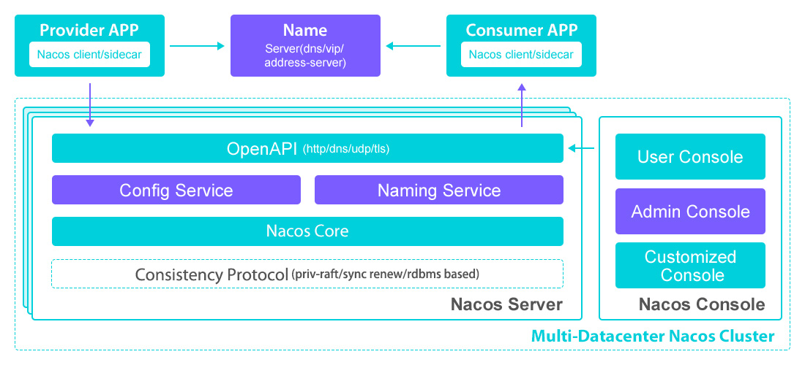

  <h1 align="center">Nacos Service Discovery</h1>
  

    <a href="README_zh.md"><strong>简体中文</strong></a> | <strong>English</strong>
  

## Table of Contents

- [Repository Introduction](#repository-introduction)
- [Prerequisites](#prerequisites)
- [Image Specifications](#image-specifications)
- [Getting Help](#getting-help)
- [How to Contribute](#how-to-contribute)

## Repository Introduction
[Nacos](https://github.com/alibaba/nacos) **Nacos** provides dynamic service discovery, configuration management, and service governance capabilities to help build elastic, observable cloud-native microservices systems.

**Core Features of Nacos:**

Nacos' core features can be summarized into six key aspects:

### 1. Dynamic Service Discovery
- **Automatic service registration/deregistration**: Supports multiple protocols (HTTP/DNS/RPC)
- **Health check mechanisms**: Multiple probe modes (TCP/HTTP/MYSQL/TTL)
- **Multi-cluster routing**: Cross-DC traffic scheduling and disaster recovery

### 2. Unified Configuration Management
- **Configuration versioning**: Supports rollback and change auditing
- **Multi-environment isolation**: Configuration segregation via Namespace/Group
- **Real-time push**: Millisecond-level configuration change notification (long polling)

### 3. Service Governance
- **Traffic weight control**: Supports canary release
- **Protection threshold**: Prevents cluster avalanche
- **Metadata management**: Custom service tags

### 4. High Availability Architecture
- **Multi-storage support**: MySQL/PostgreSQL/Apache Derby
- **Cluster mode**: Raft consensus algorithm ensures data consistency
- **SPI extension**: Supports custom plugin development

### 5. Cloud-Native Integration
- **Kubernetes adaptation**: Automatic CRD resource synchronization
- **Multi-language SDKs**: Java/Go/Python/PHP
- **Spring Cloud ecosystem**: Seamless integration with Alibaba/Spring Cloud

### 6. Observability
- **OpenMetrics compatibility**: Exposes Prometheus-format metrics
- **Operation log auditing**: Complete configuration change history
- **Event notification**: Webhook callback support

This project provides an open-source image product [**`Nacos-Monitoring and Alerting Tool`**](https://marketplace.huaweicloud.com/hidden/contents/87cc8998-8850-4c72-b682-b785c2d739c8#productid=OFFI1144192725574012928), pre-installed with Nacos software and its runtime environment, along with deployment templates. Follow the user guide to enjoy an efficient "out-of-the-box" experience.

**Architecture Design:**

> **System Requirements:**
> - CPU: 2 vCPUs or higher
> - RAM: 4GB or more
> - Disk: At least 50GB

## Prerequisites
[Register a Huawei account and activate Huawei Cloud](https://support.huaweicloud.com/usermanual-account/account_id_001.html)

## Image Specifications

| Image Specification                                                                                                                                              | Features | Notes |
|---------------------------------------------------------------------------------------------------------------------------------------------------| --- | --- |
| [Nacos2.3.0-arm-v1.0](https://marketplace.huaweicloud.com/hidden/contents/87cc8998-8850-4c72-b682-b785c2d739c8#productid=OFFI1144192725574012928) | Deployed on Kunpeng servers + Huawei Cloud EulerOS 2.0 64bit |  |

## Getting Help
- For more questions, contact us via [issue](https://github.com/HuaweiCloudDeveloper/nacos-image/issues) or Huawei Cloud Marketplace support for the specified product
- Other open-source images can be found at [open-source-image-repos](https://github.com/HuaweiCloudDeveloper/open-source-image-repos)

## How to Contribute
- Fork this repository and submit merge requests
- Synchronize updates to README.md based on your open-source image information